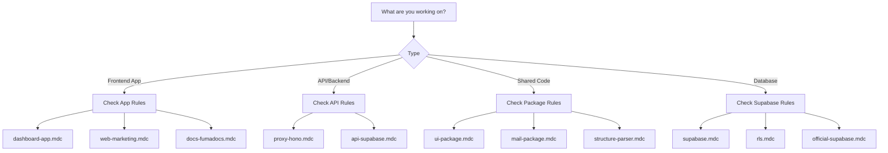

# Cursor Rules for Proxed Monorepo

This directory contains comprehensive implementation rules for each application and package in the Proxed monorepo. These rules provide AI assistants with detailed context about technologies, patterns, and best practices for each part of the codebase.

## 📋 Available Rules

### Applications

- **[proxy-hono.mdc](./proxy-hono.mdc)** - Hono API proxy implementation (Bun runtime)
- **[dashboard-app.mdc](./dashboard-app.mdc)** - Next.js dashboard with Supabase auth
- **[web-marketing.mdc](./web-marketing.mdc)** - Marketing website with animations
- **[api-supabase.mdc](./api-supabase.mdc)** - Supabase database configuration
- **[docs-fumadocs.mdc](./docs-fumadocs.mdc)** - Documentation with Fumadocs

### Packages

- **[ui-package.mdc](./ui-package.mdc)** - Shadcn UI component library
- **[mail-package.mdc](./mail-package.mdc)** - Email sending with React Email
- **[structure-parser.mdc](./structure-parser.mdc)** - Code parser/generator utilities
- **[supabase-package.mdc](./supabase-package.mdc)** - Supabase client and queries
- **[utils-package.mdc](./utils-package.mdc)** - Shared utilities and constants
- **[jobs-package.mdc](./jobs-package.mdc)** - Trigger.dev background jobs

### Core Rules

- **[official-supabase.mdc](./official-supabase.mdc)** - Supabase auth patterns
- **[supabase.mdc](./supabase.mdc)** - Database and SQL patterns
- **[trigger.mdc](./trigger.mdc)** - Trigger.dev v3 background jobs
- **[rls.mdc](./rls.mdc)** - Row Level Security policies

## 🚀 How to Use These Rules

### For AI Assistants

When working on a specific part of the codebase, refer to the relevant rule file for:

1. **Technology Stack** - Exact versions and dependencies
2. **Project Structure** - File organization patterns
3. **Implementation Patterns** - Copy-paste ready code examples
4. **Best Practices** - Do's and don'ts specific to each tech
5. **Common Pitfalls** - What to avoid

### Rule Selection Guide



## 📁 Project Structure Overview

```
proxed/
├── apps/
│   ├── api/         → api-supabase.mdc
│   ├── app/         → dashboard-app.mdc
│   ├── docs/        → docs-fumadocs.mdc
│   ├── proxy/       → proxy-hono.mdc
│   └── web/         → web-marketing.mdc
└── packages/
    ├── jobs/        → jobs-package.mdc
    ├── mail/        → mail-package.mdc
    ├── structure/   → structure-parser.mdc
    ├── supabase/    → supabase-package.mdc
    ├── ui/          → ui-package.mdc
    └── utils/       → utils-package.mdc
```

## 🔧 Technology Matrix

| App/Package | Framework | UI | Database | Auth |
|------------|-----------|-----|----------|------|
| proxy | Hono + Bun | - | Drizzle | API Keys |
| app | Next.js 15 | Shadcn | Supabase | Supabase Auth |
| web | Next.js 15 | Tailwind | - | - |
| docs | Next.js + Fumadocs | Fumadocs UI | - | - |
| api | Supabase | - | PostgreSQL | - |

## 📝 Common Patterns Across Rules

### TypeScript First
All packages use TypeScript with strict type checking.

### Monorepo Imports
```typescript
// Import from packages
import { Button } from "@proxed/ui"
import { sendEmail } from "@proxed/mail"
import { createClient } from "@proxed/supabase/server"
```

### Error Handling
```typescript
// Consistent error pattern
try {
  // operation
} catch (error) {
  if (error instanceof SpecificError) {
    // handle specific
  }
  throw new Error(error instanceof Error ? error.message : "Unknown error")
}
```

### Testing with Bun
```typescript
import { describe, it, expect } from "bun:test"
```

## 🚨 Critical Implementation Notes

### 1. Proxy App Migration
The proxy app is migrating from Next.js to Hono. Use **proxy-hono.mdc** for all new development.

### 2. Supabase Auth
Always use `@supabase/ssr` patterns from **official-supabase.mdc**, NOT deprecated auth helpers.

### 3. Trigger.dev v3
Use only v3 patterns from **trigger.mdc**. v2 patterns are deprecated and will break.

### 4. Server Components
Default to React Server Components. Only use `'use client'` when necessary.

## 🔄 Updating Rules

When updating rules:

1. Keep examples complete and runnable
2. Include all necessary imports
3. Show both correct and incorrect patterns
4. Update version numbers when upgrading dependencies
5. Test code examples before committing

## 📚 Quick Reference

### Need to implement...

- **Authentication?** → `official-supabase.mdc`
- **Background jobs?** → `trigger.mdc`
- **Email sending?** → `mail-package.mdc`
- **API endpoint?** → `proxy-hono.mdc`
- **Dashboard feature?** → `dashboard-app.mdc`
- **UI component?** → `ui-package.mdc`
- **Database migration?** → `api-supabase.mdc`
- **RLS policy?** → `rls.mdc`

## 🤝 Contributing

When adding new rules:

1. Use the `.mdc` extension
2. Follow the existing structure
3. Include comprehensive examples
4. Document common pitfalls
5. Keep it implementation-focused

Remember: These rules are for AI assistants to generate better code. Be explicit, provide examples, and anticipate common mistakes.
