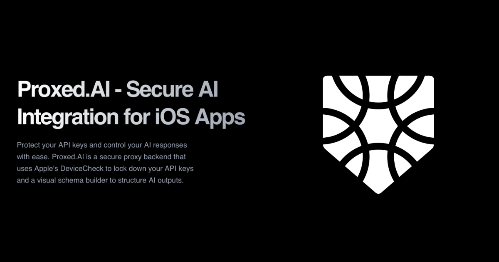

  <h1 align="center"><b>Proxed.AI</b></h1>
  

    Run your business smarter
     
     
    <a href="https://proxed.ai">Landing</a>
    ·
    <a href="https://github.com/nech-ai/proxed/issues">Issues</a>
  

## About Proxed.AI

Proxed.AI is a secure proxy backend for iOS apps that protects your AI API keys and controls AI responses. It uses Apple's DeviceCheck to lock down your API keys and provides a visual schema builder to structure AI outputs. The platform is designed to help mobile developers integrate AI features securely and efficiently.

## Features

- 🔒 **Secure Key Management**: Keep your OpenAI/LLM keys protected behind a proxy
- 🛡️ **DeviceCheck Verification**: Block illegitimate requests with Apple's DeviceCheck integration
- 🧠 **Structured Responses**: Define and enforce JSON response schemas visually
- ⚡ **Quick Integration**: Set up in under 10 minutes without any external code
- 📊 **Observability & Control**: Monitor usage, set rate limits, and manage AI models in real-time

## Get started

Documentation in progress and avaliable on https://docs.proxed.ai

## Architecture

- Monorepo
- TypeScript
- Bun
- React
- Nextjs
- Hono
- Supabase
- Shadcn
- TailwindCSS

### Hosting

- Supabase (auth, database, storage)
- Vercel (landing, portal, api)

### Services

- Resend
- Github Actions
- Polar

### Repo activity

## License

This project is licensed under the **[AGPL-3.0](https://opensource.org/licenses/AGPL-3.0)** for non-commercial use.
